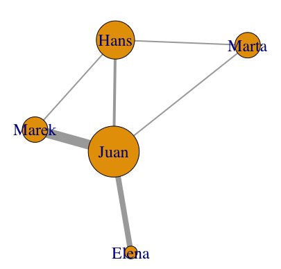

☞ Esquema del recorrido del curso

# Objeto de trabajo: redes en humanidades

- Redes de caracteres
    - Coaparición en escena: [Dracor](https://dracor.org)
    - Coaparición en novelas: [_Les Miserables_](https://bost.ocks.org/mike/miserables/)
    - Dinámicas: [Visualising the dynamics of character networks](https://maladesimaginaires.github.io/intnetviz/)
    - Paratextos: [Proyecto Bieses](https://www.bieses.net/editorial.html)
- Redes Textuales
    - [Estilometría de obras teatrales](https://editio.github.io/grafos/teatro)
- Redes Históricas:
    - [Mapping the archives of the League of Nations ICIC (1919-1927)](https://grandjeanmartin.github.io/intellectual-cooperation)
- Redes espaciales
    - [Centro y periferia en la novela bizantina](https://editio.github.io/mapping.literature/spatialnet.html#persiles_core_vs_periphery)
- Redes Bibliográficas
    
    - Citación: [Vosviewer](https://tinyurl.com/y36v4cb3)
    - Similitud de contenido: [Connected Papers](https://www.connectedpapers.com/main/3149a915f738f044778e3decdb4278e2bad17808/Gephi%3A-An-Open-Source-Software-for-Exploring-and-Manipulating-Networks/graph)

- Redes culturales
    - [Premios y premiados](https://w.wiki/52Ju) 

# Redes

- Método de representación de patrones de conexión o interacción entre partes de sistema. 

- El concepto de red supone una estructura relacional que puede ser estudiada (1) de forma lógica y matemática: Teoría de grafos (disciplina). 
- (2) Exploración por medio de la visualización.

## Conceptos básicos. Nodos y enlaces

- Red: puntos unidos por líneas.
- Puntos: **nodos** o vértices (_nodes_ o _vertices_).
- Líneas: **aristas** o enlaces (_edges_ o _links_).
- Atributos: información extra sobre nodos o aristas
- Tipos de redes:
    - Definen los nodos: bipartitas, simples
    - Definen las aristas: múltiples, indirectas,...

## Red simple


## Red bipartita  


 
## Red múltiple 

 

# Formalización y formatos

## Formalización

Lista de aristas, matrices, lista de adyacencia, ...

**Lista de aristas (_edgelist_)**: es conjunto de datos estructurados (tabla) que contiene como mínimo dos columnas: una columna de nodos que son el origen de una conexión (_source_) y otra columna de nodos que son el destino de la conexión (_target_). El resto de columnas corresponden a los atributos.

|source |target|weight|lang|type|
|-------|------|----|-----|----|
|Juan|Elena |4 |esp     |undirected|
|Juan|Hans  |2  |de     |undirected|
|Juan|Marta  |1 |eng     |undirected|
|Juan|Marek |1  |de     |undirected|
|...|... |... |...|...|

**Matriz de adyacencia (Adjacency matrix)**: una matriz cuadrada (igual número de columnas y filas)

| |Juan|Hans|Elena|Marta|Marek|
|--|--|------|----|-----|----|
|**Juan**|0|1|1|1|1|
|**Hans**|1|0|0|1|1|
|**Elena**|1|0|0|0|0|
|**Marta**|1|1|0|0|0|
|**Marek**|1|1|0|0|0|

[...]

# Formatos

- ```CSV```. Lista de aristas en CSV:

```
source,target,lengua,weight
Juan,Elena,esp,4
Juan,Hans,de,2
Juan,Marta,eng,1
Juan,Marek,de,1
Juan,Marek,esp,1
Juan,Marek,pol,5
Hans,Marta,eng,1
Hans,Marek,de,1
```

- ```gexf``` (XML)

```xml
[...]
      <node id="Marek" label="Marek">
        <attvalues>
          <attvalue for="att1" value="2.0"/>
        </attvalues>
        <viz:size value="4.0"/>
        <viz:position x="-22.013721" y="26.080078"/>
        <viz:color r="255" g="99" b="71"/>
      </node>
    </nodes>
    <edges>
      <edge id="0" source="Juan" target="Hans" weight="2.0"/>
      <edge id="1" source="Juan" target="Elena" weight="4.0"/>
      <edge id="2" source="Juan" target="Marta"/>
      <edge id="3" source="Juan" target="Marek" weight="7.0"/>
      <edge id="4" source="Hans" target="Marta"/>
      <edge id="5" source="Hans" target="Marek"/>
    </edges>
  </graph>
</gexf>
```

- [Más formatos](https://gephi.org/users/supported-graph-formats/) (reconocidos por Gephi)

# Visualización. Algoritmos

Misma red, distinta visualización


Red bipartita


## Algoritmos para dibujar el grafo


- Clásicos en Gephi: _Force Atlas 2_, _Fruchterman Reingold_,...


# Métricas



- _Degree centrality_: nº de conexiones.
- _Betweenness centrality_: nodos puente. 
- _Eigenvector centrality_: nodos conectados a nodos.


- _Modularity_ (Louvain, Leiden algorithms): agrupaciones de nodos
- ...

> Algee-Hewitt, Mark (2017): “Distributed Character: Quantitative Models of the English Stage, 1550–1900”, _New Literary History_, 48, 4, pp. 751-782, <https://doi.org/10.1353/nlh.2017.0038>.

# Herramientas: tratamiento, métricas, visualización

- Lenguajes de Programación: R, Python, JavaScript
- Gephi, Cytoscape, VOSviewer (Bibliometría)

## Gephi. [Open Graph Viz Platform](https://gephi.org)

- Descarga, instalación, interfaz
- Plugins: multimode networks transformation; geolayout; sigma exporter.
    - Multimode networks transformation: "You can project your bipartite (2-mode) graph to monopartite (one-mode) graph." 

# Datos y archivos

## Teatro

- Dracor

## Premios literarios

- Red de premios y premiados 

# Prácticas paso a paso
 
## Red de caracteres: _La vida es sueño_

☞ Practicar los fundamentos de una lista de aristas, cómo cargarla en Gephi y realizar los primeros pasos de visualización y métricas.

1. Dracor > tools > https://ezlinavis.dracor.org > Examples > Calderón > descarga _edge list_.
2. Gephi > Import spreadsheet (CSV) > next > finish.
3. Layout: Fruchterman Reingold.
4. Medidas de centralidad: Segismundo frente a Clarín.
5. Color y tamaño de nodos. 

☞ Conocer el archivo en formato gexf, abrir en Gephi, atributos de los nodos (masculino/femenino).

1. Dracor > corpora > [Calderon Corpora](https://dracor.org/cal) > Calderón, _La vida es sueño_ > Downloads > Archivo en gexf.
2. Gephi > open > [sin cambios] > ok
3. Appearance > nodes > color [icono paleta] > Partition > Choose an attribute > gender
4. Pruebas de métricas y layouts.

## De los datos a la formalización: premios y premiados

☞ Pasar de datos estructurados (tabla de datos) a una formalización de una lista de aristas (gexf)

1. Materiales en Github > data > ```premios_premiados.csv```
2. [table2net](https://medialab.github.io/table2net/) 
3. Load table > Type of Network > Nodes > Edges > Build the network

## Red de premios y premiados (1)

☞ Trabajar con redes más grandes, explorar redes bipartitas.

1. Gephi > open ```premios_premiados.gexf```...

## Red de premios y premiados (2)

☞ Pasar de un tipo de red a otro

1. Plugin: multimode networks transformation
2. Premios
3. Autores

## Formatos de publicación.

☞ Formas de representación estática y dinámica de los grafos

1. Preview panel: export svg, png, pdf
2. Plugin: Sigma Exporter


# Tutoriales, manuales, bibliografía

- Katherine Ognyanova, [Static and dynamic network visualization with R](https://kateto.net/network-visualization), 2021

- Albert-László Barabási, [Network Science](http://networksciencebook.com), 2016
- Katharina A. Zweig, _Network Analysis Literacy: A Practical Approach to the Analysis of Networks_, Springer, 2016.

- Mark Newman, _Networks: An Introduction_, Oxford University Press, 2010